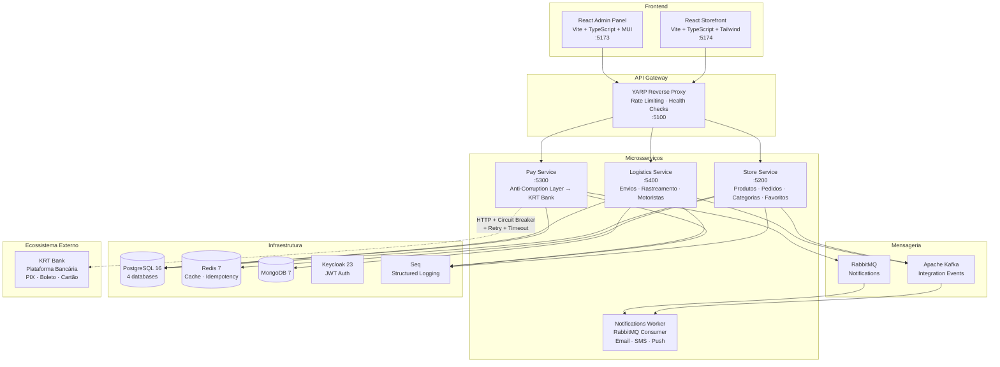
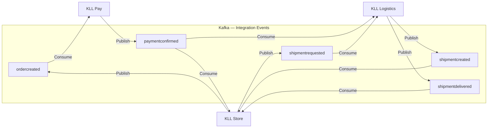
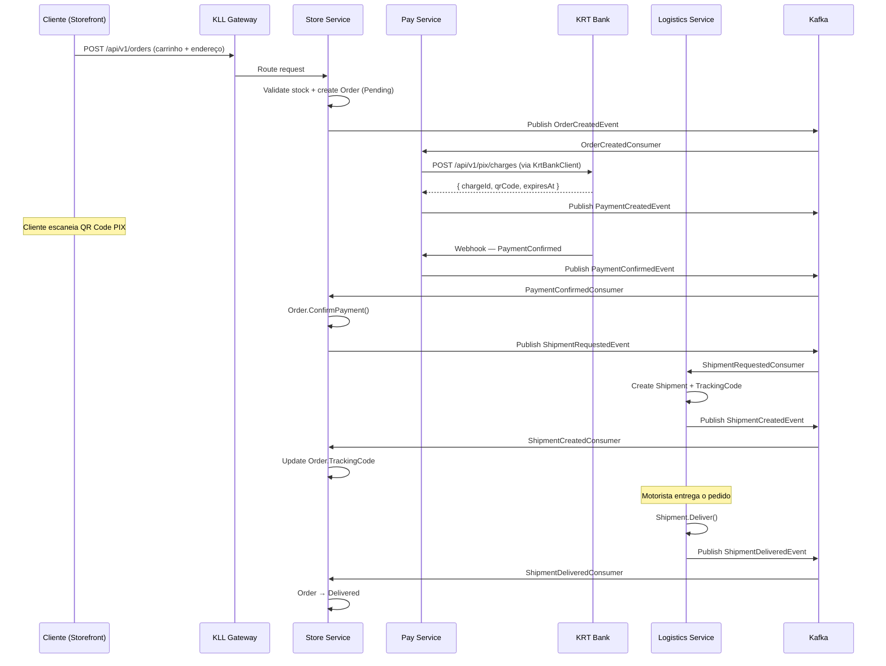
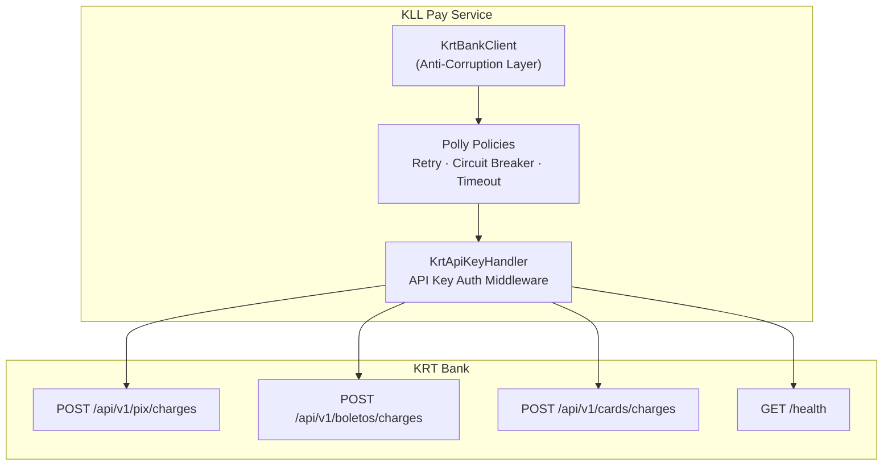

<div align="center">
  <h1>💎 KLL Platform — AUREA Maison</h1>
  <p><strong>E-commerce de Joias de Luxo — Microsserviços com .NET 8</strong></p>
  <p>
    
    
    
    
    
  </p>
  <p><em>⚠️ Projeto Demo — Case de portfólio. Nenhuma transação é real.</em></p>
</div>

---

## Sobre o Projeto

**KLL Platform** é uma plataforma e-commerce de luxo completa inspirada em marcas como Vivara e Tiffany, construída com arquitetura de microsserviços em **.NET 8** e frontends em **React 18**.

O projeto demonstra domínio prático de:

- **Clean Architecture** com camadas rigorosamente separadas (Domain → Application → Infrastructure → API)
- **DDD Tático** — Entities, Value Objects (`Money`, `Address`, `Email`, `CPF`), Domain Events, Aggregates
- **CQRS** com MediatR e pattern `Result<T>` para tratamento de erros
- **Saga Pattern** — `OrderSagaOrchestrator` com compensação automática em caso de falha
- **Event-Driven Architecture** — Kafka para eventos de integração entre serviços
- **Outbox Pattern** — garantia de entrega exatamente-uma-vez de eventos
- **Anti-Corruption Layer** — abstração completa da integração bancária com o KRT Bank

> 📦 **Parte do Ecossistema:** A KLL Platform integra-se com o [KRT Bank](https://github.com/KlistenesLima/krt-bank) para processar pagamentos reais via PIX (QR Code), Boleto e Cartão de Crédito, utilizando Circuit Breaker com Polly e fallback automático.

---

## Funcionalidades

- ✅ Catálogo de produtos com filtros, busca, ordenação e paginação
- ✅ Página de produto premium com galeria de imagens
- ✅ Carrinho de compras (localStorage + sincronização)
- ✅ Checkout em 3 etapas (Endereço → Envio → Pagamento)
- ✅ Pagamento via PIX com QR Code real (via KRT Bank)
- ✅ Pagamento via Boleto com código de barras real (via KRT Bank)
- ✅ Pagamento via Cartão de Crédito (via KRT Bank)
- ✅ Favoritos (API persistente)
- ✅ Sistema de categorias hierárquico
- ✅ Rastreamento de entregas com timeline de eventos
- ✅ Painel administrativo completo (Dashboard, Pedidos, Produtos, Categorias, Entregas)
- ✅ Anti-Corruption Layer para integração bancária
- ✅ Circuit Breaker (Polly) com fallback automático
- ✅ Saga de pedido com compensação (criação → pagamento → envio → entrega)
- ✅ Notificações via RabbitMQ (Email, SMS, Push)
- ✅ Rate Limiting no API Gateway (100 req/min global, 20 req/min checkout)
- ✅ Upload de imagens para Backblaze B2 (S3-compatible)

---

## Screenshots

<!-- Adicionar screenshots quando disponível -->
| Storefront | Admin Panel | Checkout PIX |
|------------|-------------|--------------|
|  |  |  |

---

## Arquitetura



---

## Tech Stack

| Camada | Tecnologias |
|--------|-------------|
| **Storefront** | React 18, TypeScript, Tailwind CSS 3.4, Zustand, Vite, QRCode.React, React Hot Toast |
| **Admin Panel** | React 18, TypeScript, Material-UI 5, MUI X-DataGrid, TanStack React Query 5, Recharts, Vite |
| **Backend** | .NET 8, ASP.NET Core Web API, C# 12, MediatR 12.4, FluentValidation 11, Polly 8.4 |
| **Arquitetura** | Clean Architecture, DDD, CQRS, Saga Pattern, Outbox Pattern, YARP Gateway |
| **Banco de Dados** | PostgreSQL 16 (4 databases por serviço), Redis 7 (cache/idempotency), MongoDB 7 |
| **Mensageria** | Apache Kafka (integration events) + RabbitMQ (notifications) |
| **Autenticação** | Keycloak 23 (JWT Bearer), políticas AdminOnly / UserOnly |
| **Resiliência** | Polly (Circuit Breaker, Retry com Backoff, Timeout) |
| **Observabilidade** | Serilog → Seq, Health Checks (PostgreSQL, Redis, Kafka, RabbitMQ) |
| **Cloud Storage** | Backblaze B2 (S3-compatible) — imagens de produtos |
| **Containerização** | Docker, Docker Compose (14 containers) |
| **Testes** | xUnit, Moq, FluentAssertions, Vitest + Testing Library (frontend) |

---

## Estrutura do Projeto

```
kll-platform/
├── src/
│   ├── BuildingBlocks/                          # Shared Kernel
│   │   ├── KLL.BuildingBlocks.CQRS/            # ICommand, IQuery, Handler abstractions
│   │   ├── KLL.BuildingBlocks.Domain/          # BaseEntity, Value Objects (Money, Address, Email, CPF)
│   │   ├── KLL.BuildingBlocks.EventBus/        # Kafka producer/consumer + RabbitMQ integration
│   │   ├── KLL.BuildingBlocks.Infrastructure/  # Auth middleware, Health Checks, Serilog, Middleware
│   │   └── KLL.BuildingBlocks.Outbox/          # Outbox pattern — exactly-once event delivery
│   │
│   ├── Services/
│   │   ├── KLL.Gateway/                        # YARP Reverse Proxy — Rate Limiting, CORS, Health
│   │   │
│   │   ├── KLL.Store/                          # Catálogo, Pedidos, Categorias, Favoritos
│   │   │   ├── KLL.Store.Domain/               #   Product, Order (Aggregate), OrderItem, Category
│   │   │   ├── KLL.Store.Application/          #   MediatR Handlers, OrderSagaOrchestrator
│   │   │   ├── KLL.Store.Infra.Data/           #   EF Core + PostgreSQL (kll_store)
│   │   │   └── KLL.Store.Api/                  #   13 Controllers (Products, Orders, Cart, Categories...)
│   │   │
│   │   ├── KLL.Pay/                            # Gateway de Pagamentos + Anti-Corruption Layer
│   │   │   ├── KLL.Pay.Domain/                 #   Transaction, Merchant entities
│   │   │   ├── KLL.Pay.Application/            #   KrtBankClient, Kafka consumers, Polly policies
│   │   │   │   └── Integration/
│   │   │   │       └── KrtBankClient            #     Anti-Corruption Layer → KRT Bank
│   │   │   ├── KLL.Pay.Infra.Data/             #   EF Core + PostgreSQL (kll_pay)
│   │   │   └── KLL.Pay.Api/                    #   8 Controllers (Pix, Boleto, Card, Webhooks...)
│   │   │
│   │   ├── KLL.Logistics/                      # Envios, Rastreamento, Motoristas
│   │   │   ├── KLL.Logistics.Domain/           #   Shipment, TrackingEvent, Driver
│   │   │   ├── KLL.Logistics.Application/      #   Kafka consumers, Handlers
│   │   │   ├── KLL.Logistics.Infra.Data/       #   EF Core + PostgreSQL (kll_logistics)
│   │   │   └── KLL.Logistics.Api/              #   Controllers (Shipments, Tracking)
│   │   │
│   │   └── KLL.Notifications/                  # Background Worker
│   │       └── KLL.Notifications.Worker/       #   RabbitMQ consumer (Email, SMS, Push)
│   │
│   └── Web/
│       ├── kll-admin-web/                      # React 18 + MUI + React Query
│       │   └── src/
│       │       ├── pages/                      #   Dashboard, Products, Orders, Shipments
│       │       ├── components/                 #   DataGrid, Forms, Charts (Recharts)
│       │       └── services/                   #   API clients (Axios)
│       │
│       └── kll-storefront/                     # React 18 + Tailwind + Zustand
│           └── src/
│               ├── pages/                      #   Home, Catalog, Product, Cart, Checkout
│               ├── components/                 #   ProductCard, CartDrawer, QRCode, Timeline
│               ├── stores/                     #   Zustand stores (cart, auth, favorites)
│               └── styles/theme.ts             #   Design system AUREA Maison
│
├── tests/
│   ├── KLL.Store.Tests/                        # 76 unit tests
│   ├── KLL.Store.UnitTests/                    # 15 unit tests (Favorites, Address, Shipping)
│   ├── KLL.Store.IntegrationTests/             # 19 integration tests (WebApplicationFactory)
│   ├── KLL.Pay.Tests/                          # 10 unit tests
│   ├── KLL.Pay.UnitTests/                      # 17 unit tests
│   ├── KLL.Logistics.Tests/                    # 6 unit tests
│   ├── KLL.Logistics.UnitTests/                # 12 unit tests
│   └── KLL.Logistics.IntegrationTests/         # 2 integration tests
│
├── infra/keycloak/                             # Realm configuration
├── .github/workflows/                          # CI/CD pipelines
├── docker-compose.yml                          # 14 containers
├── Makefile                                    # Dev commands (make up, make store, make admin...)
└── .env.example                                # Template de variáveis de ambiente
```

---

## Containers

| Container | Imagem | Porta | Função |
|-----------|--------|-------|--------|
| `kll-storefront` | React 18 (Vite) | **5174** | Loja do cliente — catálogo, carrinho, checkout |
| `kll-admin-web` | React 18 (Vite) | **5173** | Painel administrativo — dashboard, pedidos, produtos |
| `kll-gateway` | .NET 8 (YARP) | **5100** | API Gateway — roteamento, rate limiting, CORS |
| `kll-store-api` | .NET 8 | **5200** | Microsserviço Store (Produtos, Pedidos, Categorias) |
| `kll-pay-api` | .NET 8 | **5300** | Microsserviço Pay (Anti-Corruption Layer → KRT Bank) |
| `kll-logistics-api` | .NET 8 | **5400** | Microsserviço Logistics (Envios, Rastreamento) |
| `kll-postgres` | postgres:16-alpine | **5434** | 4 databases (store, pay, logistics, keycloak) |
| `kll-redis` | redis:7-alpine | **6381** | Cache e idempotency |
| `kll-mongodb` | mongo:7 | **27018** | Dados complementares |
| `kll-kafka` | confluentinc/cp-kafka:7.5.0 | **39092** | Integration events entre serviços |
| `kll-zookeeper` | confluentinc/cp-zookeeper:7.5.0 | — | Coordenação do Kafka |
| `kll-rabbitmq` | rabbitmq:3-management | **5673 / 15673** | Filas de notificação |
| `kll-keycloak` | keycloak:23.0 | **8083** | Identity Provider (JWT) |
| `kll-seq` | datalust/seq | **8082** | Dashboard de logs estruturados |

---

## Comunicação entre Serviços



| Tópico Kafka | Produtor | Consumidor(es) | Payload |
|-------------|----------|----------------|---------|
| `ordercreated` | Store | Pay, Logistics | OrderId, CustomerId, TotalAmount, Items[] |
| `paymentconfirmed` | Pay | Store, Logistics | OrderId, ChargeId, Amount, Timestamp |
| `shipmentrequested` | Store | Logistics | OrderId, RecipientName, Address, Weight |
| `shipmentcreated` | Logistics | Store | ShipmentId, OrderId, TrackingCode |
| `shipmentdelivered` | Logistics | Store | ShipmentId, OrderId, DeliveredAt |

**RabbitMQ** — Filas de notificação processadas pelo `KLL.Notifications.Worker`:
- `email.notifications` — Confirmação de pedido, tracking updates
- `sms.notifications` — Alertas de entrega
- `push.notifications` — Notificações mobile

---

## Fluxo de Checkout e Pagamento



---

## Integração com o Ecossistema — KRT Bank

O **KLL Pay** funciona como Anti-Corruption Layer, isolando a complexidade da integração bancária do resto do sistema:



**Métodos de pagamento suportados:**

| Método | Endpoint KRT Bank | Retorno |
|--------|-------------------|---------|
| **PIX** | `POST /api/v1/pix/charges` | QR Code (EMV BRCode), ChargeId, ExpiresAt |
| **Boleto** | `POST /api/v1/boletos/charges` | Código de barras, Linha digitável, Vencimento |
| **Cartão** | `POST /api/v1/cards/charges` | ChargeId, Status (Authorized), Parcelas (1-12x) |

**Resiliência da integração:**

| Mecanismo | Configuração |
|-----------|-------------|
| **Retry** | 3 tentativas com backoff exponencial (1s, 2s, 4s) |
| **Circuit Breaker** | Abre após 3 falhas consecutivas, aguarda 30s |
| **Timeout** | 10s por requisição |
| **Health Check** | Verifica `/health` do KRT Bank antes de cada operação |
| **Fallback** | Quando KRT Bank está offline → oferece "Cartão Simulado" |

---

## Design System — AUREA Maison

A storefront segue um design system premium de luxo, inspirado em joalherias de alto padrão:

| Propriedade | Valor |
|------------|-------|
| **Cor primária (Dourado)** | `#c9a962` (light: `#d4b87a`, dark: `#b08942`) |
| **Background** | `#0f0f1a` (quase preto) |
| **Surface** | `#1a1a2e` (dark blue) |
| **Accent** | `#16213e` (deep blue) |
| **Texto primário** | `#e0e0e0` (light gray) |
| **Fonte display** | Playfair Display (serif) — títulos e branding |
| **Fonte corpo** | Poppins (sans-serif) — conteúdo e UI |
| **Efeitos** | Glassmorphism, hover com glow dourado, shimmer animations |
| **Touch targets** | Mínimo 44px (mobile-first) |

---

## Como Executar

```bash
# 1. Clone o repositório
git clone https://github.com/KlistenesLima/kll-platform.git
cd kll-platform

# 2. Configure as variáveis de ambiente
cp .env.example .env
# Edite o .env com suas credenciais

# 3. Suba todos os containers
docker compose up -d
# Ou usando o Makefile:
make up

# 4. Verifique
docker ps --format "table {{.Names}}\t{{.Status}}\t{{.Ports}}"

# 5. Acesse
# Storefront:    http://localhost:5174
# Admin Panel:   http://localhost:5173
# Gateway API:   http://localhost:5100
# Swagger Store: http://localhost:5200/swagger
# Swagger Pay:   http://localhost:5300/swagger
# Swagger Log:   http://localhost:5400/swagger
# Keycloak:      http://localhost:8083
# RabbitMQ:      http://localhost:15673
# Seq Logs:      http://localhost:8082
```

> **Nota:** Para pagamentos reais via PIX/Boleto/Cartão, o [KRT Bank](https://github.com/KlistenesLima/krt-bank) precisa estar rodando. Caso contrário, o fallback "Cartão Simulado" será utilizado.

---

## Testes

```bash
# Backend (.NET)
dotnet test KLL.Platform.sln    # 157 testes, 0 falhas

# Frontend (Storefront)
cd src/Web/kll-storefront && npm test    # 87 testes Vitest

# Total: 244 testes, 0 falhas
```

| Projeto | Testes | Tipo |
|---------|--------|------|
| KLL.Store.Tests | 76 | Unit (Domain, Services, Handlers, Validators) |
| KLL.Store.UnitTests | 15 | Unit (Favorites, Address, Shipping) |
| KLL.Store.IntegrationTests | 19 | Integration (WebApplicationFactory) |
| KLL.Pay.Tests | 10 | Unit (Transaction, Merchant) |
| KLL.Pay.UnitTests | 17 | Unit (Transaction, Merchant extended) |
| KLL.Logistics.Tests | 6 | Unit (Shipment, TrackingEvents) |
| KLL.Logistics.UnitTests | 12 | Unit (Shipment lifecycle) |
| KLL.Logistics.IntegrationTests | 2 | Integration (Lifecycle) |
| kll-storefront (Vitest) | 87 | Unit + Component (React Testing Library) |
| **Total** | **244** | **100% passing** |

---

## Roadmap

- [ ] Busca com Elasticsearch (full-text search no catálogo)
- [ ] Avaliações e reviews de produtos
- [ ] Cupons de desconto e promoções
- [ ] Notificações push em tempo real (SignalR no storefront)
- [ ] Deploy cloud (Oracle Cloud Free Tier / AWS)
- [ ] CI/CD completo com GitHub Actions

---

## Autor

<div align="center">
  <strong>Klístenes Lima</strong><br/>
  Senior .NET Software Engineer<br/><br/>
  <a href="https://linkedin.com/in/klisteneslima">
    
  </a>
  <a href="https://github.com/KlistenesLima">
    
  </a>
</div>

---

## Licença

Este projeto está licenciado sob a licença MIT. Veja o arquivo [LICENSE](LICENSE) para mais detalhes.

---

<div align="center">
  <sub>
    <strong>KLL Platform — AUREA Maison</strong> — E-commerce de luxo completo<br/>
    .NET 8 · React 18 · Kafka · RabbitMQ · PostgreSQL · Docker · Keycloak<br/><br/>
    Parte do ecossistema integrado com <a href="https://github.com/KlistenesLima/krt-bank">KRT Bank</a>
  </sub>
</div>
